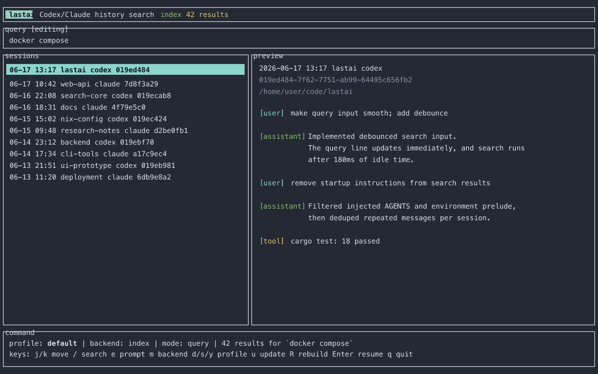

# lastai

Fast local full-text search and resume launcher for Codex and Claude histories.

`lastai` indexes local JSONL history files, opens a terminal UI for browsing
past sessions, and launches `codex resume` or `claude --resume` with selectable
profiles.



## Features

- Local TUI for searching, previewing, and resuming sessions.
- Custom lightweight segment-based inverted index.
- CJK substring support through n-gram candidate search and verification.
- Query filters for provider, cwd, role, date, session id, and sidechain state.
- Literal, regex, and fzf-like fuzzy scan backends when an index is not enough.
- Vim-style TUI navigation and debounced search input.
- Configurable resume profiles such as `default`, `safe`, and `yolo`.
- Nix flake and cargo-dist metadata for release packaging.

Tantivy is intentionally not used in v1.

## Install

From a local checkout:

```sh
cargo install --path .
```

From GitHub:

```sh
cargo install --git https://github.com/gorira-tatsu/lastai
```

With Nix:

```sh
nix run github:gorira-tatsu/lastai
```

Release builds are intended to be produced with `cargo-dist`, including a
Homebrew formula once tagged releases are published.

## Quick Start

```sh
lastai index rebuild
lastai
```

Useful commands:

```sh
lastai                         # open the TUI
lastai tui docker              # open the TUI with an initial query
lastai search docker --limit 20
lastai search 'provider:codex role:user "cargo test"' --json
lastai search 'docker.*compose' --backend regex
lastai search dkcps --backend fuzzy
lastai resume <session-id> --provider codex --profile yolo
lastai index update
lastai index status
lastai doctor
```

If your terminal appears blank, use:

```sh
LASTAI_NO_ALT_SCREEN=1 lastai
# or
lastai tui --no-alt-screen
```

## History Locations

`lastai` discovers history files from:

- Codex: `$CODEX_HOME` or `~/.codex`
- Claude: `$CLAUDE_CONFIG_DIR` or `~/.claude`

The index is stored in the OS cache directory. Run `lastai doctor` to print the
exact config and cache paths.

## Query Syntax

- Terms use AND semantics by default.
- Phrases use quotes: `"docker compose"`.
- Prefix search uses `*`: `cargo*`.
- Filters:
  - `provider:codex` or `provider:claude`
  - `cwd:lastai`
  - `role:user`
  - `after:2026-06-01`
  - `before:2026-06-17`
  - `session:<id-fragment>`
  - `sidechain:true`

Examples:

```sh
lastai search 'provider:codex cwd:lastai tokenizer'
lastai search 'role:user "index rebuild"'
lastai search '日本語検索'
lastai search 'docker.*compose' --backend regex
```

## TUI Keys

- `j` / `k`: move selection
- `g` / `G`: jump to first / last result
- `/` or `i`: enter search mode
- `e`: edit the prompt passed to resume
- Arrow keys, `Home`, `End`, `Delete`, `Backspace`, `Ctrl-A`, `Ctrl-E`,
  `Ctrl-U`, and `Ctrl-W`: edit search or prompt text
- `m`: cycle backend: `index` -> `fuzzy-scan` -> `regex-scan` -> `literal-scan`
- `d` / `s` / `y`: select `default`, `safe`, or `yolo` profile
- `u`: update the index
- `R`: rebuild the index
- `Ctrl-D` / `Ctrl-U`: scroll the conversation preview down/up in normal mode
- `Enter`: resume selected session
- `Esc`: leave input mode; quit from normal mode
- `q`: quit from normal mode

The preview pane shows the selected session's conversation in chronological
order when it is available from the index or scan cache.

## Search Backends

- `auto`: default. Uses the index when available, otherwise fuzzy scan.
- `index`: uses the segment-based inverted index.
- `literal`: scans parsed history and requires all query tokens.
- `regex`: scans parsed history with a case-insensitive Rust regex.
- `fuzzy`: scans parsed history with an fzf-like ordered-character scorer.

For regular use, build the index once and use `index` or `auto`.

## Config

The config file is stored in the OS project config directory, shown by
`lastai doctor`.

```toml
max_indexed_bytes_per_message = 262144
index_recent_days = 90
index_max_files = 600

[providers.codex]
command = "codex"
resume_args = ["resume", "{profile_args}", "{session_id}", "{prompt}"]

[providers.codex.profiles]
default = []
safe = ["-s", "workspace-write", "-a", "on-request"]
yolo = ["--yolo"]

[providers.claude]
command = "claude"
resume_args = ["{profile_args}", "--resume", "{session_id}", "{prompt}"]

[providers.claude.profiles]
default = []
safe = []
yolo = ["--dangerously-skip-permissions"]
```

`{profile_args}` must be a standalone argument. Commands are executed with
`std::process::Command`, not by shell interpolation.

## Privacy

`lastai` reads local AI conversation histories. Those histories and the derived
index can contain private prompts, code, file paths, and command output. The
tool is local-first, but the cache should still be treated as sensitive.

See [docs/PRIVACY.md](docs/PRIVACY.md) before sharing logs, screenshots, or
cache files.

## Development

```sh
cargo fmt --all --check
cargo clippy --all-targets -- -D warnings
cargo test
cargo build --release
cargo bench --no-run
nix build
```

## License

MIT. See [LICENSE](LICENSE).
